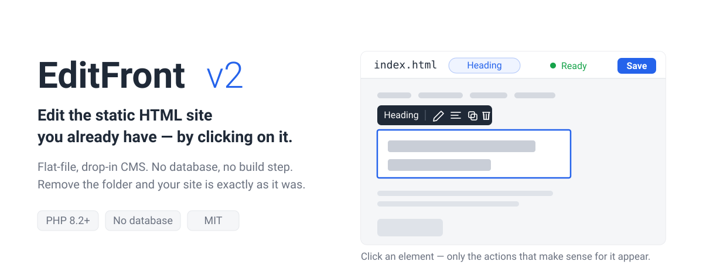
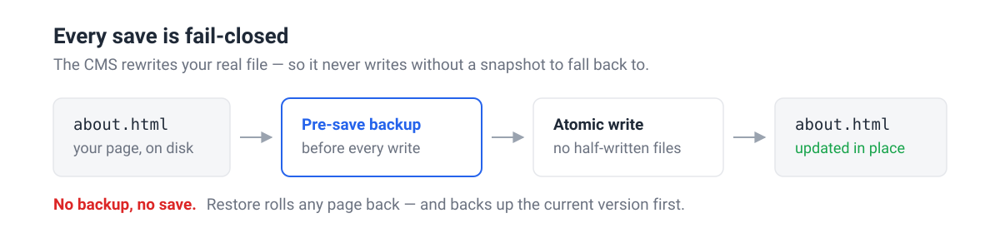
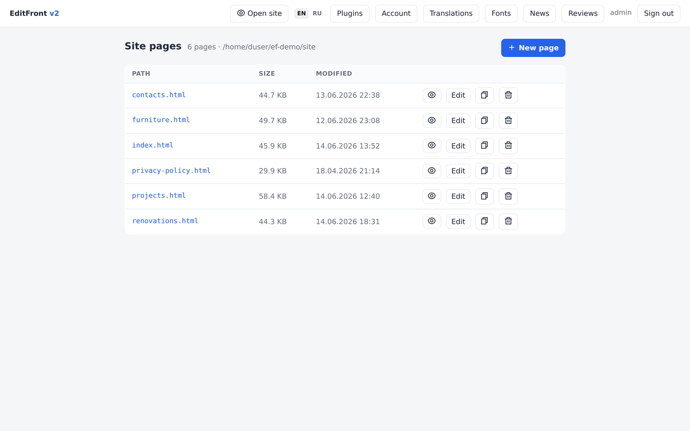
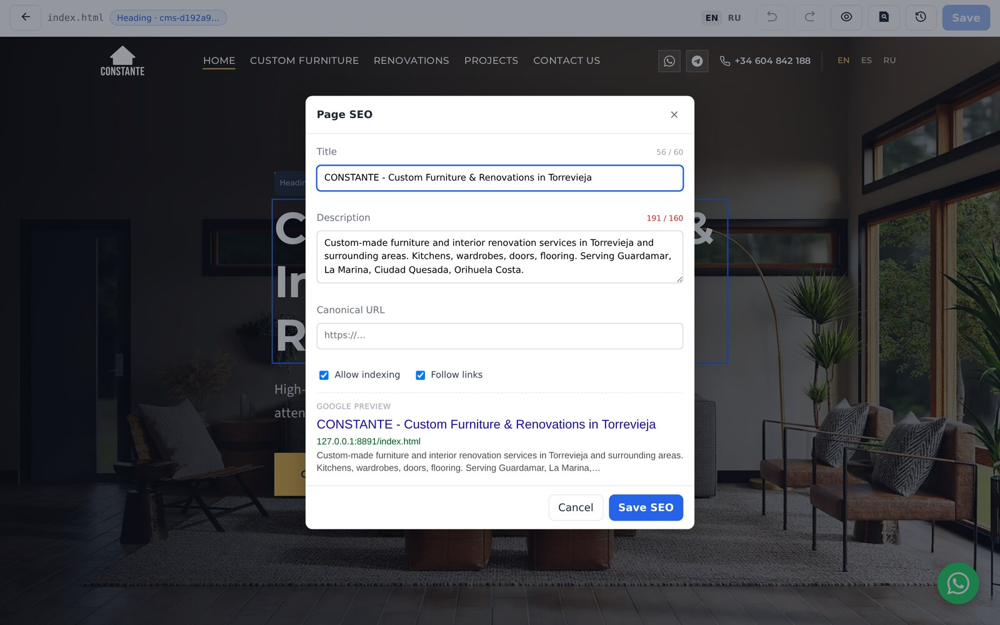

[](https://github.com/canabeo/EditFront-v2/actions/workflows/ci.yml)
[](LICENSE)
[](composer.json)


## What it is

A flat-file CMS you unzip into a subfolder of a site you already have. It reads
the existing `.html` files, lets you edit them by clicking on the page, and
writes them back. There is no database and no build step, and it is meant for
cheap shared hosting (Apache + php-fpm).

## Why it's different

Most page builders make you rebuild your site inside their world. EditFront
edits the HTML you already have, in place.

Click an element and a small context panel appears with only the actions that
make sense for it — there is no permanent inspector wall of CSS fields. When you
save, the CMS rewrites the real `.html` file. Remove the CMS folder and your
site is exactly as it was.



Atomic writes only (`flock` + tmp + `fsync` + rename), so a failed save never
leaves a half-written page.

## Features

**Editing**

- **On-page editing** — click to select, edit text, size, alignment, links,
  images; duplicate, move, delete. Panels appear on demand.
- **Per-action undo/redo** — every action is one undo step, including plugin
  actions (<kbd>Ctrl</kbd>+<kbd>Z</kbd> / <kbd>Ctrl</kbd>+<kbd>Y</kbd>,
  <kbd>Ctrl</kbd>+<kbd>S</kbd> saves). Automatic drafts restore your
  in-progress history on reopen.

**Your files stay yours**

- **Never destructive** — a pre-save backup before every save, and restore is
  itself backed up first.
- **Pages, media, backups** — create / duplicate / delete pages; upload images
  (auto-converted to WebP) into your site's own folder; browse and restore
  pre-save snapshots.

**Content**

- **Per-page SEO** — title / description / canonical / robots with a live Google
  snippet, plus a noindex-aware `sitemap.xml` and `robots.txt`.
- **News & reviews** — a visual news/blog engine and a review-moderation queue
  (public submit → approve / edit / reject), both rendered to static HTML.
- **Self-hosted fonts** — upload fonts or use bundled Cyrillic-ready presets,
  delivered via a managed `@font-face` block. No external font services.

**Extend & operate**

- **Plugins** — schema-driven custom block types in `plugins/<slug>/`; a plugin
  that fails its round-trip checks loads read-only and never breaks the page.
- **i18n UI** — ships in English and Russian, with an in-app translation editor
  and the ability to add languages.
- **Secure by default** — session + CSRF on all writes, rate-limited login with
  captcha/lockout escalation, security headers, layered HTML/CSS/URL/SVG
  sanitizers, `.htaccess` that denies access to internals. See
  [SECURITY.md](SECURITY.md).

## Quick start

1. Unzip into your site so you get `https://example.com/cms/`.
2. Open `https://example.com/cms/install` and run the 3-step wizard
   (environment check → page detection → create the administrator).
3. Sign in at `https://example.com/cms/login` and start editing.

> **Run the wizard right after uploading.** Until an administrator exists,
> anyone who reaches `/install` first could create it — so the installer closes
> itself (410 Gone) the moment an admin is created.

Full install & usage guide: **[USAGE.md](USAGE.md)**.

## Screenshots

| Dashboard | Per-page SEO |
|---|---|
|  |  |

## Requirements

- PHP **8.2+** with `dom`, `mbstring`, `json`, `fileinfo` (`gd` recommended for
  WebP image conversion)
- Apache with `mod_rewrite` (bundled `.htaccess`) — or nginx, in which case you
  MUST apply [`nginx.conf.example`](nginx.conf.example): nginx ignores
  `.htaccess`, and without those rules `storage/` (your password hash) is
  public. The install wizard checks this and refuses to continue if it is. Or a
  front-controller rule
- A writable install folder during setup (to create `.env` and `storage/`)

## Develop

```bash
composer install
vendor/bin/phpunit          # full suite
php -S localhost:8080       # with a router, or use the bundled .htaccess
```

Code is PSR-4 under `EditFront\` → `app/src/`. Routes, DI and middleware live in
`app/bootstrap.php`; every route resolves from the container with zero manual
factories (guarded by `ContainerRoutesTest`).

## Plugins & examples

Custom block types live in `plugins/<slug>/`. The bundled `plugins/pricing-table`
is a self-contained example. More involved reference plugins — including how to
**adopt markup that already exists on a site** — are under
[`examples/plugins/`](examples/plugins/) (these are not auto-loaded and are not
shipped in the release ZIP).

> Plugin PHP is trusted code, like a WordPress plugin. Only install plugins you
> trust.

## License

[MIT](LICENSE) — see also [CHANGELOG.md](CHANGELOG.md).
